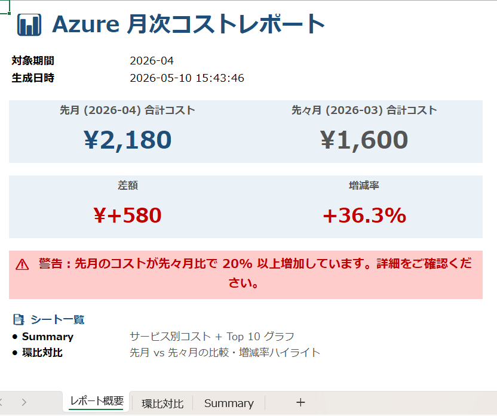
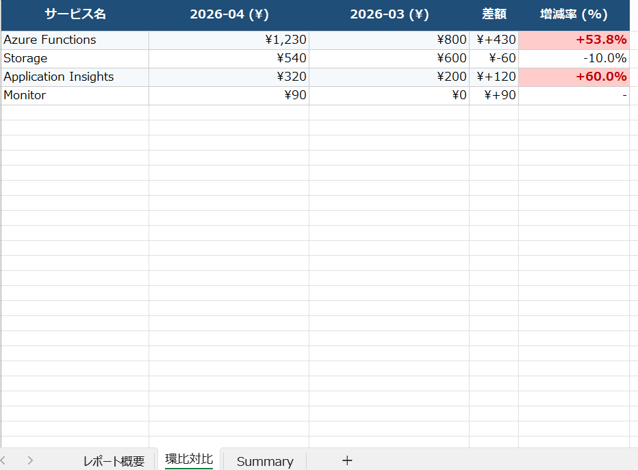
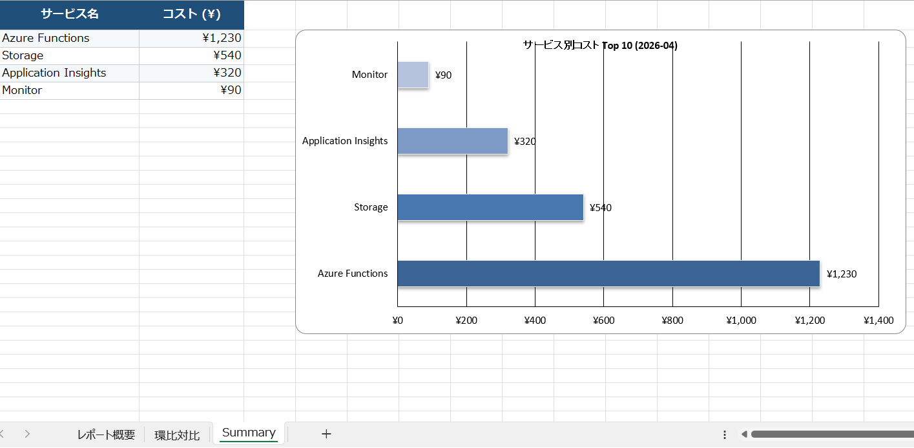

# Azure 利用状況月次レポート自動化 Demo

[](https://azure.microsoft.com/)
[](https://www.python.org/)
[](https://azure.microsoft.com/services/functions/)

Azure Functions の Timer Trigger を活用し、毎月初めに前月の Azure 利用コストを Cost Management API から自動取得・集計し、グラフ・KPI カード・前月比ハイライトを含む Excel レポートを Blob Storage に自動出力する **FinOps 向けデモシステム** です。

---

## 🎯 プロジェクト概要

| 項目 | 内容 |
|------|------|
| **目的** | Azure 利用料金の月次集計を自動化し、コスト可視化を実現 |
| **期間** | 2026年5月（個人プロジェクト） |
| **役割** | 要件定義・設計・実装・デプロイ・ドキュメント整備（一人で全工程担当） |
| **規模** | 約 350 行の Python コード + Azure リソース 3 種 |

---

## 🏗️ アーキテクチャ


---

## 📊 サンプル出力

### レポート概要（KPIカードレイアウト）
合計コスト・前月比・警告メッセージを一目で確認できるダッシュボード。



### 環比対比（増減率ハイライト）
±20% を超えるサービスを赤・緑で自動ハイライト。



### サービス別コスト + Top 10 グラフ
横棒グラフでコスト構成を視覚化。



---

## 🛠️ 使用技術

| カテゴリ | 技術スタック |
|---------|------------|
| Compute | Azure Functions (Python 3.11, V2 model, Linux Consumption Plan) |
| データ取得 | Azure Cost Management API |
| ストレージ | Azure Blob Storage |
| 認証 | Managed Identity（キーレス認証）|
| 監視 | Application Insights |
| Python ライブラリ | pandas, openpyxl, azure-identity, azure-mgmt-costmanagement, azure-storage-blob |
| 開発環境 | VS Code, Azure Functions Core Tools v4, Azure CLI |
| バージョン管理 | Git, GitHub |

---

## ✨ 主な機能

- ⏰ **毎月 1 日 9:00 UTC** に Timer Trigger で自動起動
- 📊 Cost Management API でサービス別・月単位のコストを取得
- 📈 先月 vs 先々月の **環比対比**（増減率 ±20% は自動で赤・緑ハイライト）
- 🎴 **レポート概要シート**（合計コスト・前月比・警告メッセージのKPIカード）
- 📉 **棒グラフ付きサマリー**（Top 10 サービス）
- 🔄 レートリミット (429) 対応の指数バックオフ・リトライ処理
- 🔐 Managed Identity による **キーレス認証**

---

## 🚀 ローカル実行

### 必要環境

- Python 3.11
- Node.js 20+ (Azure Functions Core Tools 用)
- Azure Functions Core Tools v4
- Azure CLI

### セットアップ

```bash
# 仮想環境を作成
python -m venv .venv
.venv\Scripts\Activate.ps1   # Windows PowerShell
# source .venv/bin/activate    # Mac/Linux

# 依存関係をインストール
pip install -r requirements.txt

# Azure にログイン
az login
```

### local.settings.json を作成

```json
{
  "IsEncrypted": false,
  "Values": {
    "AzureWebJobsStorage": "",
    "FUNCTIONS_WORKER_RUNTIME": "python",
    "SUBSCRIPTION_ID": "",
    "STORAGE_ACCOUNT_NAME": "",
    "REPORT_CONTAINER_NAME": "reports"
  }
}
```

> ⚠️ `local.settings.json` は機密情報を含むため `.gitignore` で git 追跡対象外に設定済。

### 起動

```bash
func start
```

別ターミナルで手動トリガー：

```powershell
Invoke-RestMethod `
  -Uri "http://localhost:7071/admin/functions/monthlyCostReport" `
  -Method Post `
  -Headers @{"Content-Type"="application/json"} `
  -Body "{}"
```

---

## ☁️ デプロイ

```bash
func azure functionapp publish  --python --build remote
```

> `--build remote` で Azure 側でビルドを実行し、Linux 環境差異を吸収。

### Application Settings（Function App）

| Key | 説明 |
|-----|------|
| `AzureWebJobsStorage` | Function ランタイム用 Storage 接続文字列 |
| `SUBSCRIPTION_ID` | 対象 Azure サブスクリプション ID |
| `STORAGE_ACCOUNT_NAME` | レポート出力先 Storage Account 名 |
| `REPORT_CONTAINER_NAME` | Blob コンテナ名（デフォルト: `reports`）|
| `AzureWebJobsFeatureFlags` | `EnableWorkerIndexing`（V2 model 必須） |

### 必要な RBAC（Managed Identity）

Function App の System-assigned Managed Identity に以下を付与：

- **Cost Management Reader**（Subscription scope）
- **Storage Blob Data Contributor**（Storage Account scope）

---

## 💎 工夫した点

### 設計面
- **本番運用を意識した構成**：Managed Identity 認証を採用し、コードに認証情報を一切含めない
- **キー管理の自動化**：Function App のシステム ID を経由することで、Storage Key の手動管理を不要に

### エラーハンドリング
- **Cost Management API のレートリミット (429) 対策**：指数バックオフによる最大 5 回リトライを実装
- **コンテナ不存在の自動補完**：初回実行時にコンテナがなければ自動作成
- **データ欠損時のフォールバック**：「データなし」シートを生成し、ジョブ全体は成功扱い

### 可視化
- **単なる数値の羅列ではなく KPI カード化**：合計コストを大きく表示し、前月比を色付きで強調
- **増減率 ±20% の自動ハイライト**：赤=注意、緑=改善、を視覚的に判別可能
- **金額の符号付き表示**：差額列は `¥+580` `¥-60` 形式で増減を一目で判別

### 保守性
- **色・フォント定数を共通化**：テーマ変更時の修正箇所を最小化
- **ヘルパー関数の責務分離**：`beautify_sheet`、`add_bar_chart`、`write_cover_sheet` 等で機能ごとに分割

### ドキュメント
- **アーキテクチャ図（Mermaid）+ サンプル画像 + 踏んだ落とし穴** を README に集約
- **再現性を担保**：他の人がこの README だけで同じシステムを構築できる粒度

---

## 🎓 学んだこと・技術知見

### Azure 全般
- **Resource Provider 登録**：新規サブスクリプションでは `Microsoft.Storage` 等を明示的に登録する必要がある場合がある
- **コントロール層 vs データ層の RBAC 分離**：Owner であっても Storage Blob のデータアクセスには別途 `Storage Blob Data Contributor` が必要
- **Managed Identity の伝播時間**：ロール付与から実際に有効になるまで 1-5 分かかる
- **Linux Consumption Plan の制約**：Python は Windows 非対応、`--build remote` でビルド環境を Azure 側に委譲

### Python / Azure Functions
- **V2 Programming Model**：`AzureWebJobsFeatureFlags=EnableWorkerIndexing` の設定が必須
- **DefaultAzureCredential の認証順序**：環境変数 → MSI → CLI の順で試行する仕組み
- **datetime シリアライズ**：Cost Management SDK は ISO 8601 datetime（時刻付き）を要求し、`date.isoformat()` の出力では受け付けない

### Cost Management API
- **厳しいレートリミット**：1 分あたり数回程度。本番運用では 429 ハンドリング必須
- **Grouping の柔軟性**：ServiceName / ResourceGroup / ResourceId / Tag 等で多次元集計可能

### セキュリティ運用
- **キー漏洩時の即時対処**：Storage Account Key のローテーションを実践
- **`.gitignore` の事前設定の重要性**：機密ファイルが git に追加される前に防御線を張る
- **Gmail Connector Policy（Logic Apps）**：Google が連携可能サービスをホワイトリスト化しており、Azure Blob Storage との同時使用は不可

---

## 🐛 開発中に踏んだ落とし穴と対処

| # | ハマりポイント | 原因 | 対処 |
|---|--------------|-----|------|
| 1 | PowerShell でスクリプト実行不可 | デフォルト ExecutionPolicy が `Restricted` | `Set-ExecutionPolicy -Scope CurrentUser -ExecutionPolicy RemoteSigned` |
| 2 | Storage Account 作成時のエラー | 名前に `_` を含めた（小文字英数字のみ許可） | 命名ルールに従い修正 |
| 3 | Cost Management API 429 エラー | API のレートリミット | 指数バックオフ・リトライを実装 |
| 4 | Blob アップロード時 403 (AuthorizationPermissionMismatch) | `Storage Blob Data Contributor` 未付与 | 自分と Function App の MSI 両方に付与 |
| 5 | Container 不存在エラー (404) | コンテナ作成し忘れ | コード内で `create_container()` を try/except で実行する設計に変更 |
| 6 | デプロイ後 `function list` が空 | V2 model の Worker Indexing が未有効 | `AzureWebJobsFeatureFlags=EnableWorkerIndexing` を Application Settings に追加 + `--build remote` で再デプロイ |
| 7 | datetime シリアライズエラー | `date.isoformat()` は日付のみ、SDK は datetime を要求 | `datetime.combine(date, time.min/max)` で時刻を合成 |
| 8 | Excel フォントが MS P ゴシックに置換 | `Yu Gothic` の名前解決失敗 | `Meiryo` に変更（日本語 Windows で必ず存在） |
| 9 | Logic Apps Gmail 連携でポリシー違反 | Google が `azureblob` 連携を禁止 | Demo 範囲外として未実装、Outlook / SendGrid / ACS が代替案 |

---

## 🔮 今後の拡張アイデア

- 📧 自動メール配信（Outlook / SendGrid / Azure Communication Services）
- 📈 Power BI ダッシュボード連携
- 🌐 多サブスクリプション対応・サブスクリプション横断比較
- 🏗️ Bicep / Terraform による IaC 化
- 🚀 GitHub Actions での CI/CD パイプライン
- 📊 Azure Monitor Metrics でリソース稼働状況レポート（CPU・メモリ・リクエスト数）
- 🤖 異常検知の自動アラート（Logic Apps + Teams 通知）

---

## 🙏 振り返り

ゼロベースから着手し、Azure CLI / Functions Core Tools / VS Code / Git のローカル開発環境構築から、Managed Identity による本番運用レベルの認証設計、レートリミット対応、Excel グラフ生成、リモートデプロイ、セキュリティ運用（Key ローテーション）まで、**クラウドネイティブな自動化システムの全ライフサイクル** を実体験できた。

特に「ドキュメントに書いてある手順通りにやれば動く」段階を超えて、**ハマりポイントを自力で診断・解決する力** が身についたのが最大の収穫。Cost Management API の 429、Storage の RBAC 分離、V2 model の indexing、Gmail Connector Policy など、いずれも本番運用で必ず遭遇する課題であり、それらを事前に経験できた価値は大きい。

---

## 📝 ライセンス

このプロジェクトは個人学習・ポートフォリオ目的で作成されました。コードは自由に参考・改変いただけます。