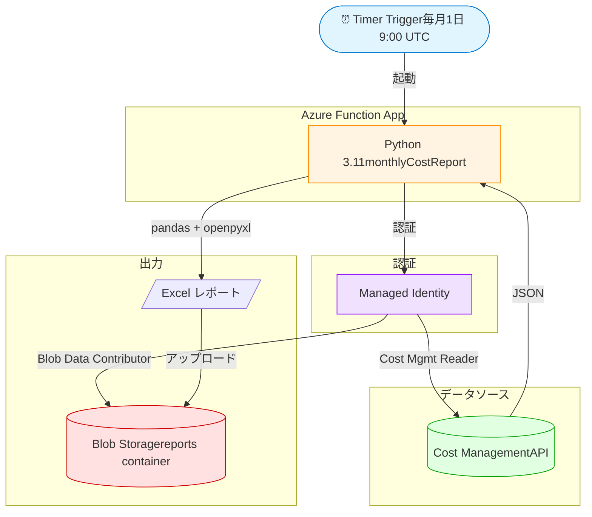

# Azure 利用状況月次レポート自動化 Demo

Azure Functions の Timer Trigger を使って、毎月初めに前月の Azure 利用料金を集計し、Excel レポートを Blob Storage に出力する Demo プロジェクトです。

## アーキテクチャ



## 使用技術

- Azure Functions (Python 3.11, V2 model, Linux Consumption Plan)
- Azure Cost Management API
- Azure Blob Storage
- Azure Managed Identity (キーレス認証)
- pandas / openpyxl

## 主な機能

- 毎月自動実行（Timer Trigger）
- ServiceName / ResourceGroup 単位でコストを集計
- レートリミット (429) 対応のリトライ処理
- データなし時の空ファイル生成（エラー回避）

## ローカル実行

### 必要環境

- Python 3.11
- Azure Functions Core Tools v4
- Azure CLI

### セットアップ

```bash
# 依存関係をインストール
pip install -r requirements.txt

# Azure にログイン
az login

# local.settings.json を作成（example を参照）

# ローカル起動
func start
```

### 手動トリガー

```bash
curl -X POST http://localhost:7071/admin/functions/monthlyCostReport \
  -H "Content-Type: application/json" -d "{}"
```

## デプロイ

```bash
func azure functionapp publish <FUNCTION_APP_NAME> --python --build remote
```

## 環境変数

`local.settings.json` および Function App の Application Settings に以下を設定：

| Key | 説明 |
|-----|------|
| `AzureWebJobsStorage` | Storage Account の接続文字列 |
| `SUBSCRIPTION_ID` | 対象の Azure サブスクリプション ID |
| `STORAGE_ACCOUNT_NAME` | レポート出力先の Storage Account 名 |
| `REPORT_CONTAINER_NAME` | Blob コンテナ名（デフォルト: `reports`）|
| `AzureWebJobsFeatureFlags` | `EnableWorkerIndexing` (V2 model 必須) |

## 必要な権限（Managed Identity）

- `Cost Management Reader` (Subscription scope)
- `Storage Blob Data Contributor` (Storage Account scope)

## ライセンス

MIT
