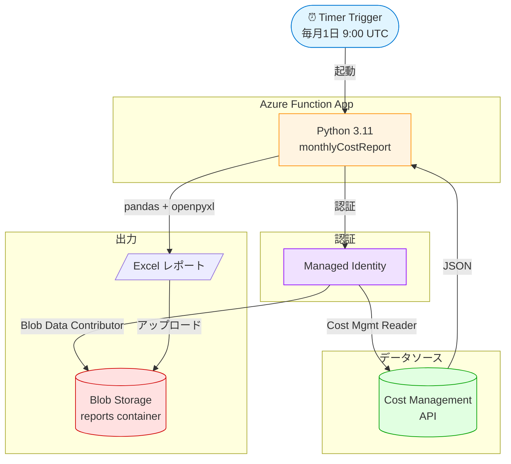

# Azure 利用状況月次レポート自動化 Demo

Azure Functions の Timer Trigger を使って、毎月初めに前月の Azure 利用料金を集計し、図表入りの Excel レポートを Blob Storage に自動出力するデモプロジェクトです。

## 主な機能

- 毎月 1 日 9:00 UTC に Timer Trigger で自動起動
- Cost Management API でサービス別・月単位のコストを取得
- 先月 vs 先々月の **環比対比**（増減率 ±20% は自動で赤・緑ハイライト）
- **レポート概要シート**（合計コスト・前月比・警告メッセージのKPIカード）
- **棒グラフ付きサマリー**（Top 10 サービス）
- レートリミット (429) 対応のリトライ処理
- Managed Identity による **キーレス認証**

## アーキテクチャ



## サンプル

### レポート概要（KPIカードレイアウト）


### 先月 vs 先々月の比較（増減率ハイライト）


### サービス別コスト + Top 10 棒グラフ


## 使用技術

- Azure Functions (Python 3.11, V2 model, Linux Consumption Plan)
- Azure Cost Management API
- Azure Blob Storage
- Azure Managed Identity
- pandas / openpyxl（Excel 整形・グラフ生成）

## ローカル実行

### 必要環境

- Python 3.11
- Azure Functions Core Tools v4
- Azure CLI

### セットアップ

```bash
# 仮想環境を作成
python -m venv .venv
.venv\Scripts\Activate.ps1   # Windows
# source .venv/bin/activate    # Mac/Linux

# 依存関係をインストール
pip install -r requirements.txt

# Azure にログイン
az login

# local.settings.json を作成（リポジトリには含まれません）
```

### local.settings.json のサンプル

```json
{
  "IsEncrypted": false,
  "Values": {
    "AzureWebJobsStorage": "<Storage Account 接続文字列>",
    "FUNCTIONS_WORKER_RUNTIME": "python",
    "SUBSCRIPTION_ID": "<対象サブスクリプション ID>",
    "STORAGE_ACCOUNT_NAME": "<Storage Account 名>",
    "REPORT_CONTAINER_NAME": "reports"
  }
}
```

### 起動

```bash
func start
```

別ターミナルで手動トリガー：

```bash
curl -X POST http://localhost:7071/admin/functions/monthlyCostReport \
  -H "Content-Type: application/json" -d "{}"
```

## デプロイ

```bash
func azure functionapp publish <FUNCTION_APP_NAME> --python --build remote
```

## 必須の Application Settings（Function App）

| Key | 説明 |
|-----|------|
| `AzureWebJobsStorage` | Function ランタイム用 Storage 接続文字列 |
| `SUBSCRIPTION_ID` | 対象 Azure サブスクリプション ID |
| `STORAGE_ACCOUNT_NAME` | レポート出力先 Storage Account 名 |
| `REPORT_CONTAINER_NAME` | Blob コンテナ名（デフォルト: `reports`）|
| `AzureWebJobsFeatureFlags` | `EnableWorkerIndexing`（V2 model 必須） |

## 必要な権限（Managed Identity）

Function App の System-assigned Managed Identity に以下の RBAC を付与：

- **Cost Management Reader**（Subscription scope）
- **Storage Blob Data Contributor**（Storage Account scope）

## 開発過程で踏んだ落とし穴

- PowerShell スクリプト実行ポリシー（`RemoteSigned` 設定が必要）
- Storage Account 名のフォーマット制約（小文字・英数字のみ）
- Cost Management API のレートリミット（429）対応
- Storage Blob Data 層の RBAC 分離（Owner でも別途付与必要）
- V2 model の `AzureWebJobsFeatureFlags=EnableWorkerIndexing` 必須
- Python date.isoformat() は datetime ではなく日付のみ → SDK が要求する ISO 8601 datetime と不一致

## 拡張アイデア（未実装）

- Outlook / SendGrid / Communication Services での自動メール配信
- Power BI 連携でのダッシュボード化
- 多サブスクリプション対応
- Bicep / Terraform による IaC 化
- GitHub Actions による CI/CD
- Azure Monitor Metrics で性能レポート（CPU、メモリ等）